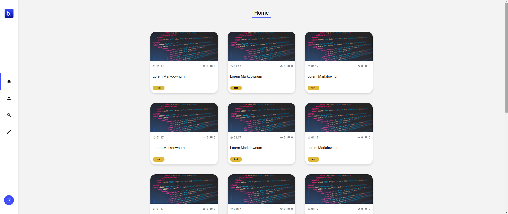
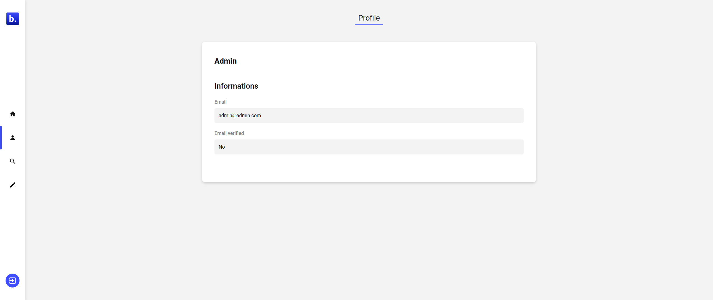
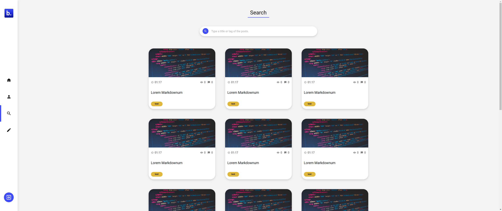
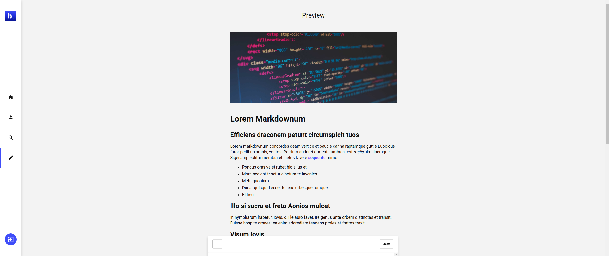

<div align="center">
  
</div>

## Table of Contents

- [Overview](#overview)
  - [About](#about)
  - [Demo](#demo)
  - [To do](#to-do)
  - [Techs](#techs)
- [Start](#start)
  - [Development](#development)
  - [Production](#production)
- [Contact](#contact)

## Demo


 



 



## About

Basically Byte is a simple blog with the focus on technology articles, inside the webpage is possible to see articles with differents topics.

In this website I've created an email confirmation system, for now this system is not perfect at all, so will need some improvements too. The used technologies are **NodeMailer** and **Handlebars** for create the email interface.

Currently only an account with admin role is allowed to create articles, and the only way to set this role is changing them on the database. I think that the best option, perhaps, is to create a different application with an admin dashboard or something like that.

## To do

> Currently the project is suffering with some performace issues, The markdown parser has not much speed at all, so focus is some optmization is good point

- Loading screen between home and article
- Password changing on the profile page
- Improves on responsiveness

## Technologies

- Docker
- Docker compose
- Git
- Node
- Yarn

## Start

### Development

In the development enviroment you can just run with node scripts, you can check them inside the **package.json**

> In that method we don't will to use docker so, the database (**mongodb**) will need to installed on your machine.

```bash
  # Will start the client on your localhost
  yarn client:dev

  # Will start the node server, necessary to have the database (mongodb) installed
  yarn server:dev
```

---

### Production

In the production enviroment you will only need docker and docker compose installed on your machine.

```bash
  # Will start all the nescessary things to start the application
  docker-compose up
```

## Contact

- GitHub [@mathmorais](https://github.com/mathmorais)
